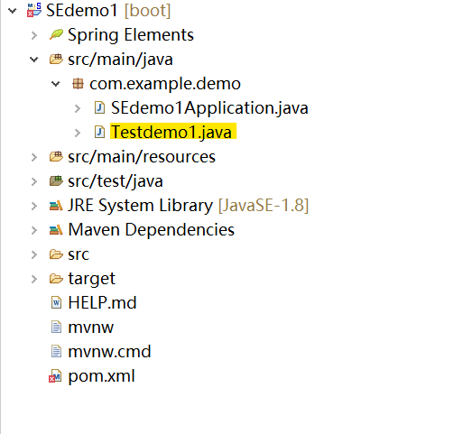

# 2021SE_Final_Project_MyWorkplace
My Private Workplace.

### 1. 创造新项目

参考：[SpringBoot入门：使用IDEA和Eclipse构建第一个SpringBoot项目](https://blog.csdn.net/qq_41153943/article/details/102470669)

TestDemo1使用端口：8888

- 修改端口：

  ​	在`application.properties`中修改：`server.port=8888`

- 端口被占用：cmd杀掉。关掉页面后过一会儿系统会自动杀掉。

  ```shell
  C:\Users\cici>netstat -ano|findstr "8888"
    TCP    0.0.0.0:8888           0.0.0.0:0              LISTENING       20488
    TCP    [::]:8888              [::]:0                 LISTENING       20488
  
  C:\Users\cici>TASKKILL /F /PID 20488
  成功: 已终止 PID 为 20488 的进程。
  ```

#### DEMO1：Hello World

java文件的路径在：D:\workspace\SEdemo1\src\main\java\com\example\demo

eclipse内在这里👇：



```java
package com.example.demo;

import org.springframework.web.bind.annotation.RequestMapping;
import org.springframework.web.bind.annotation.RestController;
@RestController
public class Testdemo1 {
	 @RequestMapping("/hello")
	   public String HelloController() {
	      return "Hello World";
	 }
}
```

可以通过http://localhost:8888/hello访问，最后的标识符用`@RequestMapping("~")`内的字符决定。

- 有关``@RequestController``和`@RequestMapping("~")`：可以参考👉[SpringBoot 中常用注解@Controller/@RestController/@RequestMapping介绍](https://blog.csdn.net/u010412719/article/details/69710480)
